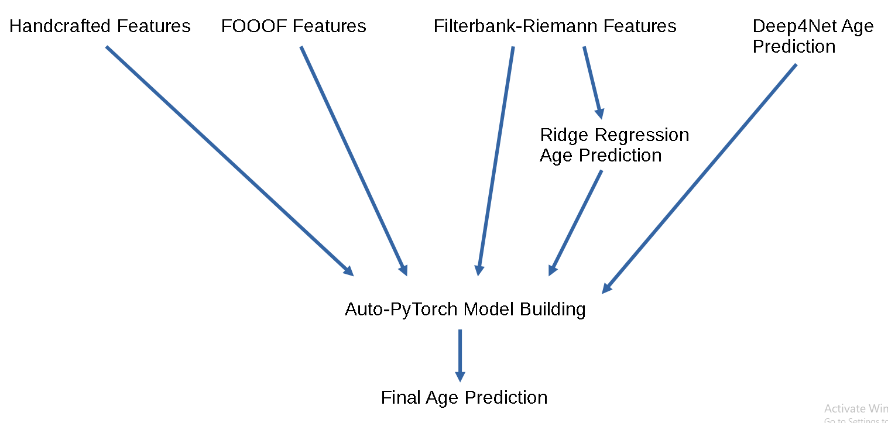

# BrainAge
Approach used by State++ to come in 2nd place during NeuroTechX's Brain Age Prediction Challenge 2022: https://codalab.lisn.upsaclay.fr/competitions/8336

## Overview
**The approach consisted of feature generation + auto-pytorch model building.**

Features used included:

- Handcrafted features  (Engemann et al., 2022)
- Filterbank-Riemann features  (Engemann et al., 2022)
- age predictions from Filterbank-Riemann-based ridge regression (Engemann et al., 2022)
- age predictions from Deep4Net (Schirrmeister et al., 2017; Engemann et al., 2022; Banville et al., 2022) 
- fooof aperiodic components as well as periodic components in 0.5 hz bins from 1-40hz (Donoghue et al., 2020; Langer et al., 2022)

**References**

Banville, H., Wood, S. U., Aimone, C., Engemann, D. A., & Gramfort, A. (2022). Robust learning from corrupted EEG with dynamic spatial filtering. *NeuroImage*, 251, 118994.

Donoghue T, Haller M, Peterson EJ, Varma P, Sebastian P, Gao R, Noto T, Lara AH, Wallis JD, Knight RT, Shestyuk A, & Voytek B (2020). Parameterizing neural power spectra into periodic and aperiodic components. *Nature Neuroscience*, 23, 1655-1665.

Engemann, D. A., Mellot, A., Höchenberger, R., Banville, H., Sabbagh, D., Gemein, L., ... & Gramfort, A. (2022). A reusable benchmark of brain-age prediction from M/EEG resting-state signals. *Neuroimage*, 262, 119521.

Langer, N., Plomecka, M. B., Tröndle, M., Negi, A., Popov, T., Milham, M., & Haufe, S. (2022). A benchmark for prediction of psychiatric multimorbidity from resting EEG data in a large pediatric sample. *NeuroImage*, 119348.

Schirrmeister, R. T., Springenberg, J. T., Fiederer, L. D. J., Glasstetter, M., Eggensperger, K., Tangermann, M., ... & Ball, T. (2017). Deep learning with convolutional neural networks for EEG decoding and visualization. *Human Brain Mapping*, 38(11), 5391-5420.
